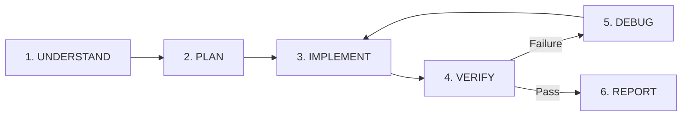

# AGENTS.md — Antigravity Autonomous Power & Project Guidelines

Welcome to the **AgriGuard Autonomous Power Setup** for Google Antigravity 2.0 / CLI.
This document governs agent autonomy, development lifecycles, embedded electronics, web applications, and security protocols.

---

## 1. Core Operating Principles

1. **High Autonomy with Verification:**
   - Execute workflows end-to-end: **Inspect ➔ Plan ➔ Execute ➔ Verify ➔ Fix ➔ Re-verify**.
   - Do not stop after discovering an initial error; diagnose root causes and resolve them autonomously.
   - Request human interaction **only** for destructive operations, external paid subscriptions, physical hardware actions, or secret credentials.

2. **Integrity & Preservation:**
   - Always inspect existing files and architecture before modifying.
   - Preserve existing working functionality and comments.
   - Prefer small, targeted, reversible changes. Never run blind bulk replacements.

3. **Absolute Secrets & Security Hygiene:**
   - Never print API keys, tokens, or credentials into chat, logs, or commit history.
   - Store credentials in `.env` or secure platform variables.
   - Validate input boundaries and prevent injection or data leakage.

---

## 2. The 6-Step Autonomous Development Loop

For every development, debugging, or optimization task, adhere to this loop:

1. **UNDERSTAND:**
   - Read the repository structure, active dependencies, and requirements.
   - Identify relevant agent skills in `.agents/skills/` and rules in `.agents/rules/`.
   - Define concrete acceptance criteria.

2. **PLAN:**
   - Formulate a concise, bulleted implementation plan.
   - Identify files, symbols, and dependencies affected.
   - Identify potential edge cases and security risks.

3. **IMPLEMENT:**
   - Make the smallest complete code edits.
   - Reuse existing utilities, schemas, and design systems.
   - Avoid adding unnecessary external packages.

4. **VERIFY:**
   - Run formatters, linters, and type checkers (`tsc`, `pyright`, `eslint`).
   - Run test suites (`pytest`, `npm test`, `playwright`).
   - For web apps: verify build output and browser rendering.
   - For firmware: verify pin mapping, power safety, and compilation.

5. **DEBUG (If anything fails):**
   - Read the exact error output and stack trace instead of guessing.
   - Locate the root cause.
   - Apply targeted fix and re-run verification until 100% passing.

6. **REPORT:**
   - Summarize what changed, files modified, checks executed, and next recommended actions.
   - **Never claim "done" if verification has not actually passed.**

---

## 3. Specialized Agent Roles

When decomposing complex tasks or delegating work, utilize these 9 specialized personas:

| Role | Responsibility |
|---|---|
| **ARCHITECT** | Designs system architecture, database schemas, and contracts before implementation. |
| **CODER** | Writes clean, typed, idiomatic implementation code adhering to project standards. |
| **DEBUGGER** | Reproduces bugs, analyzes stack traces, identifies root causes, and implements minimal fixes. |
| **TESTER** | Authors unit, integration, and E2E tests to enforce 100% test coverage and prevent regressions. |
| **BROWSER TESTER** | Verifies UI flows, responsive layouts, console logs, and visual aesthetics. |
| **EMBEDDED ENGINEER** | Handles ESP32/Arduino code, GPIO mappings, I2C/SPI sensors, serial communication, and 3.3V vs 5V voltage logic. |
| **SECURITY REVIEWER** | Audits secrets, authentication, authorization, CORS, input sanitization, and dependency vulnerabilities. |
| **DOCUMENTATION AGENT** | Synchronizes README, API specifications, and architectural diagrams with real code. |
| **GIT AGENT** | Manages branches, logical commit messages, git hygiene, and release checkpoints. |

---

## 4. Mode Guidelines

### A. ESP32 / Arduino / Embedded Electronics Mode
- **Voltage Safety:** Always verify 3.3V vs 5V logic. ESP32 GPIOs are **NOT 5V tolerant**. Always specify voltage dividers or level shifters when connecting 5V sensors.
- **Pin & GPIO Conflicts:** Check strapping pins (e.g. GPIO 0, 2, 12, 15 on ESP32) to avoid boot failures. Avoid conflict with ADC2 when Wi-Fi is active.
- **Power Budget:** Ensure sensor power draw does not exceed regulator capacity (e.g. 500mA on USB LDO).
- **Wiring Documentation:** Maintain an explicit hardware pinout table in code and markdown.
- **Credentials:** Never hardcode Wi-Fi SSID/passwords or server tokens in `.ino`/`.cpp` files. Use EEPROM, LittleFS, or compile-time headers excluded from git.

### B. Modern Web Application Mode
- **Aesthetics & UX:** Deliver rich, state-of-the-art visual experiences (glassmorphism, subtle micro-interactions, dark modes, modern typography). Never build basic or ugly MVPs.
- **Performance:** Ensure sub-200ms page transitions, responsive layouts, and zero blocking API calls.
- **Dual-Engine Architecture:** Support seamless local offline development while enabling cloud deployment (e.g. Vercel + Supabase) without hanging localhost proxy calls.
- **Verification:** Test UI state, browser console errors, and network payloads before declaring completion.

### C. Git Safety Protocol
- Inspect `git status` and `git branch` before initiating changes.
- Never overwrite uncommitted user modifications.
- Never force-push (`git push --force`) to shared branches.
- Use structured, semantic commit messages: `feat(...)`, `fix(...)`, `refactor(...)`, `docs(...)`, `test(...)`.

---

## 5. Project Directory Map

- **`backend/`**: FastAPI REST API, SQLAlchemy models, Pydantic schemas, ML classification engines, IoT sensor processing.
- **`frontend/`**: Next.js 14 App Router, Tailwind CSS, Lucide icons, Supabase client, multi-language internationalization.
- **`android/`**: Native Android companion WebView wrapper.
- **`.agents/`**: Antigravity agent configuration, specialized skills, project rules, and subagent role definitions.
