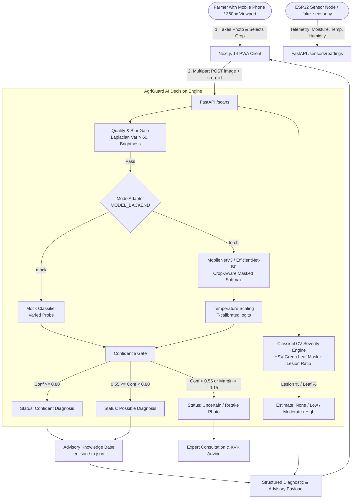

# AgriGuard System Architecture

> **Hackathon Theme:** "Samriddh Annadata, Samriddh Bharat"  
> **Mission:** AI-assisted screening and decision-support for smallholder Indian farmers.

---

## 1. System Overview

AgriGuard is designed as an edge-aware, mobile-first progressive web application (PWA) backed by a high-performance Python FastAPI service. It bridges classical computer vision, calibrated deep learning classifiers, and real-time field telemetry into an actionable, non-prescriptive advisory interface.

---

## 2. Core Processing Pipeline

1. **Client-Side Compression:**
   - Downscales captured photos to maximum 1280px client-side to minimize bandwidth consumption over 2G/3G/4G rural networks.
2. **Quality Gate (`app/services/quality.py`):**
   - Validates file format and size (≤ 8MB).
   - Computes grayscale brightness; rejects underexposed (< 25) or overexposed (> 245) photos.
   - Calculates Laplacian variance; rejects blurry shots (< 60) with a friendly retake instruction.
3. **Crop-Aware Inference (`app/ml/classifier.py`):**
   - The user selects their target crop (Tomato, Potato, Pepper).
   - Classes belonging to other crops are masked out with $-\infty$ logits before softmax.
   - Prevents biologically impossible cross-crop false positives (e.g. Potato Late Blight predicted on Pepper).
4. **Probability Calibration & Confidence Policy (`app/services/confidence.py`):**
   - Employs validation-optimized Temperature Scaling ($T$).
   - Strict gating:
     - $\ge 80\% \rightarrow$ Confident
     - $55\% - 80\% \rightarrow$ Possible (displays Top-3 differential candidates)
     - $< 55\%$ or $(\text{Top}_1 - \text{Top}_2 < 15\%) \rightarrow$ **Uncertain**: Explicitly suppresses disease names, prompts retake, and recommends local extension officer consultation.
   - Confidence is always capped at 99% to prevent misleading false certainty.
5. **Classical CV Severity Quantification (`app/services/severity.py`):**
   - Generates an HSV color mask to isolate green and healthy leaf area.
   - Generates brown/yellow/dark necrotic lesion masks within the leaf contour.
   - Calculates $\text{Affected Area} = \frac{\text{Lesion Pixels}}{\text{Leaf Pixels}} \times 100\%$.
   - Labelled strictly as **"AI estimate"** (Low <10%, Moderate 10–30%, High >30%).
6. **Safety-Compliant Agronomic Advisory (`app/api/advisory.py`):**
   - Multi-lingual advisory in English and Tamil (`ta`).
   - Strict non-prescriptive rule: zero chemical trade names, zero chemical dosages. Focuses solely on cultural sanitation, irrigation adjustments, crop rotation, and KVK contact.

---

## 3. Storage & Portability

- Storage is abstracted behind a clean `StorageBackend` protocol.
- Local disk in development (`./uploads` with thumbnail generation).
- Swappable to S3 or Supabase Storage with zero application code changes.
- Database runs on SQLite with async I/O (`aiosqlite`) for local development, and PostgreSQL (`asyncpg`) for production deployment.
