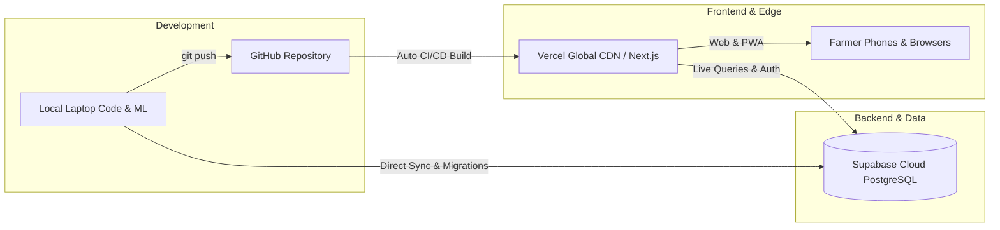

# AgriGuard Cloud Pipeline: GitHub ➔ Vercel ➔ Supabase

This guide outlines the modern production architecture for AgriGuard:



---

## 1. GitHub Setup (Source Code & Version Control)

The repository has been initialized with a clean `.gitignore` (all heavy binaries and database files excluded) and committed to the `main` branch.

### Push to your GitHub Account:
1. Create a new repository on [GitHub](https://github.com/new) named **`AgriGuard`**.
2. Run these two commands in your terminal:
```bash
git remote add origin https://github.com/<YOUR_GITHUB_USERNAME>/AgriGuard.git
git push -u origin main
```

---

## 2. Supabase Setup (Cloud PostgreSQL Database)

Your project **[Amulpappu's Project](https://supabase.com/dashboard/project/hfvdfoxsmmwhhlanumcg)** is ready.

1. **Run the One-Click Migration Script:**
   - Go to the [Supabase SQL Editor](https://supabase.com/dashboard/project/hfvdfoxsmmwhhlanumcg/sql/new).
   - Paste the contents of [`supabase_migration.sql`](../supabase_migration.sql) and click **Run**.
   - This creates all 6 tables (`users`, `crops`, `diseases`, `devices`, `sensor_readings`, `scans`) and seeds all 5 users, 14 crops, 48 disease classes, and 117 sensor readings.

2. **Copy your Database URI:**
   - Go to [Database Settings](https://supabase.com/dashboard/project/hfvdfoxsmmwhhlanumcg/settings/database).
   - Scroll to **Connection string ➔ URI**.

---

## 3. Vercel Setup (Global Next.js Hosting)

1. Go to [Vercel Dashboard](https://vercel.com/new) and click **Import Project**.
2. Select your **`AgriGuard`** repository from GitHub.
3. In the project setup screen:
   - **Framework Preset:** `Next.js`
   - **Root Directory:** `./` (or `frontend` if deploying frontend exclusively)
   - **Build Command:** `cd frontend && npm run build` (automatic via [`vercel.json`](../vercel.json))
   - **Output Directory:** `frontend/.next`
4. Add your **Environment Variables** in Vercel:
   | Key | Value |
   | :--- | :--- |
   | `NEXT_PUBLIC_SUPABASE_URL` | `https://hfvdfoxsmmwhhlanumcg.supabase.co` |
   | `NEXT_PUBLIC_SUPABASE_ANON_KEY` | *(From Supabase Project Settings ➔ API)* |
   | `BACKEND_API_URL` | *(Your backend public URL or Cloudflare tunnel URL)* |

5. Click **Deploy**. Vercel will build and assign you a global production URL (e.g., `https://agriguard.vercel.app`) with automatic HTTPS and CI/CD on every `git push`!
