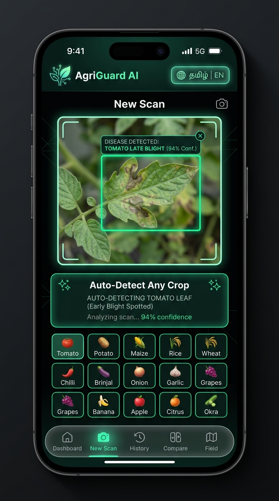
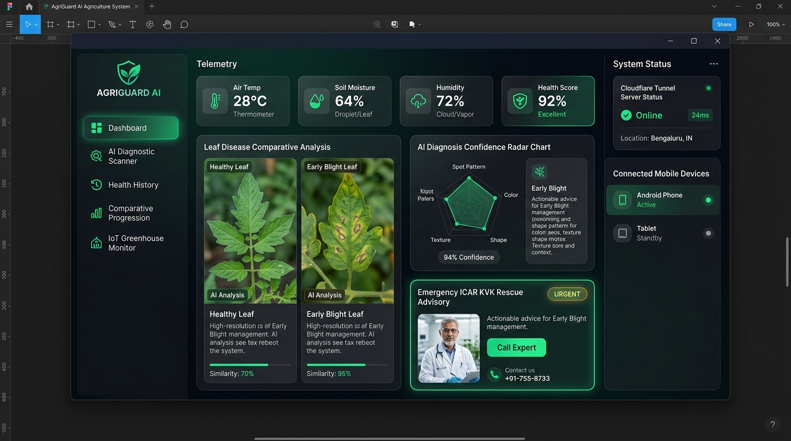

# 🎨 AgriGuard — Figma Design System & UI Specification
### Comprehensive Visual Design Guidelines for Mobile App & Desktop EXE

> **Brand Identity:** AgriGuard (அக்ரிகார்ட்) — AI-assisted crop disease screening and precision field monitoring for Indian farmers.  
> **Theme:** Obsidian Cyber-Organic (Deep dark mode with luminous emerald and neon mint accents, optimized for high contrast in outdoor sunlight).

---

## 🖼️ High-Fidelity Figma Artboards

### 1. Mobile App Design (iPhone 15 Pro / Android 360px–393px Frame)

* **Key Elements:**
  * **Top Bar:** 4K App Emblem Logo + Multilingual Language Switcher (`தமிழ் | EN`).
  * **Active Scan Viewport:** Centered leaf view with real-time AI bounding box (`Tomato Late Blight - 94% Confidence`).
  * **Auto-Detect Card:** Dedicated glowing badge showing automatic detection of crop type and disease condition.
  * **14+ Crop Grid:** Compact rounded chips for Tomato, Potato, Pepper, Rice, Wheat, Corn, Brinjal, Onion, Cotton, Banana, Mango, Grape, Cabbage, Cucumber.
  * **Floating Glassmorphic Tab Bar:** Dashboard, New Scan, History, Compare, Field Monitor.

---

### 2. Desktop EXE Application Design (Windows 11 / 1920×1080 Frame)

* **Key Elements:**
  * **Vertical Navigation Sidebar:** AgriGuard shield emblem, collapsible navigation items with active green pills.
  * **Top Telemetry Bar:** 4 Stat gauges (Air Temp 28°C, Soil Moisture 64%, Humidity 72%, Overall Health Score 92%).
  * **Comparative Analysis Workspace:** Dual-pane high-resolution comparison showing healthy leaf vs. infected leaf with similarity index and severity progression.
  * **AI Confidence Radar Chart:** 5-axis pattern visualization (Spot pattern, Color, Shape, Texture, Margin).
  * **Emergency Rescue Card:** Instant emergency action advisory, organic remedies, and 1-click KVK Agriculture Officer dialer.
  * **Right System Status Rail:** Live Cloudflare tunnel latency, connection status, and connected mobile phone/tablet devices.

---

## 🎨 Design Tokens & Styles (Figma Variables)

### 1. Color Palette

| Token Name | Hex Code | Figma Role | Usage |
| :--- | :--- | :--- | :--- |
| `color-bg-base` | `#080D0B` | Canvas Background | Deep obsidian green-black backdrop |
| `color-bg-surface` | `#0D1612` | Card Surface | Elevated card backgrounds with subtle green tint |
| `color-bg-elevated` | `#13221C` | Dialog / Modal Surface | Dropdowns, dialogs, and active selections |
| `color-primary-emerald` | `#10B981` | Brand Primary | Action buttons, active badges, confirmed statuses |
| `color-accent-mint` | `#34D399` | Neon Accent | Glowing borders, focus rings, progress meters |
| `color-accent-gold` | `#F59E0B` | Caution / Warning | Low confidence flags, moderate severity, weather alerts |
| `color-danger-crimson` | `#EF4444` | Emergency / High Severity | Severe damage alerts, urgent rescue action banners |
| `color-info-cyan` | `#06B6D4` | Telemetry / IoT | Humidity readings, comparison deltas, secondary data |
| `color-text-primary` | `#F9FAFB` | Text / High Contrast | Screen headers, primary titles, critical metrics |
| `color-text-secondary` | `#9CA3AF` | Text / Medium Contrast | Body copy, secondary guidance, descriptions |
| `color-text-muted` | `#6B7280` | Text / Low Contrast | Helper hints, timestamps, metadata labels |
| `color-border-subtle` | `rgba(255, 255, 255, 0.08)` | Dividers | Card outlines, accordion dividers, subtle borders |
| `color-border-glow` | `rgba(16, 185, 129, 0.35)` | Neon Highlight | Active card boundaries, scanner viewports |

---

### 2. Typography Scale (Inter / Outfit)

| Style Name | Font Size | Line Height | Weight | Letter Spacing | Target Elements |
| :--- | :--- | :--- | :--- | :--- | :--- |
| `Display / Large` | 32px | 38px | 800 (Bold) | -0.02em | Desktop screen titles, main score metrics |
| `Display / Medium` | 24px | 30px | 700 (Bold) | -0.01em | Mobile page headers, modal titles |
| `Heading / H1` | 20px | 26px | 600 (SemiBold)| 0 | Section titles, diagnostic condition names |
| `Heading / H2` | 16px | 22px | 600 (SemiBold)| 0 | Card headers, telemetry category labels |
| `Body / Large` | 15px | 22px | 400 (Regular) | 0 | Advisory summaries, emergency instructions |
| `Body / Regular` | 13px | 18px | 400 (Regular) | 0 | Table rows, general explanations, tips |
| `Body / Small` | 12px | 16px | 500 (Medium) | +0.01em | Metadata, timestamp, badge labels |
| `Caption / Micro` | 10px | 14px | 600 (SemiBold)| +0.02em | Disclaimers, estimate notes, status chips |

---

### 3. Grid & Spacing System

* **Base Unit:** 4px (All dimensions, paddings, and margins are multiples of 4: `4px`, `8px`, `12px`, `16px`, `24px`, `32px`, `48px`).
* **Mobile Layout Grid:**
  * Width: 360px – 393px
  * Columns: 4
  * Margins: 16px
  * Gutters: 12px
* **Desktop EXE Layout Grid:**
  * Width: 1440px – 1920px
  * Sidebar: Fixed 260px
  * Main Content: 12 Columns, 24px Gutter, 32px Margin
  * Right System Rail: Fixed 320px

---

## 🧩 Figma Component Library Architecture

### 1. Atomic Elements
* **`Button / Primary`:** Height 48px, rounded 14px, gradient `linear-gradient(135deg, #10B981 0%, #059669 100%)`, hover drop-shadow `0 8px 24px rgba(16, 185, 129, 0.25)`.
* **`Badge / Status`:** Rounded pill 9999px, height 26px, padding 4px 10px, with left status dot / icon.
* **`Card / Glassmorphic`:** Background `rgba(13, 22, 18, 0.75)`, backdrop blur 16px, border `1px solid rgba(255, 255, 255, 0.08)`, corner radius 20px.
* **`Gauge / Telemetry`:** Circular progress or vertical pill showing real-time sensor metrics with min/max threshold color coding.

### 2. Complex Modules
* **`Scanner / CameraViewport`:** 4:3 aspect ratio, interactive corner crosshairs, green neon detection box, animated scan line effect.
* **`Rescue / EmergencyActionCard`:** High-contrast amber-crimson gradient card containing immediate steps to halt crop damage, organic remedies, and KVK contact hotline.
* **`Comparison / DualPane`:** Side-by-side card with delta badges ($\Delta \text{ Severity}$, $\Delta \text{ Confidence}$, Status shift).

---

## 🚀 How to Import into Figma

1. **Option A (Instant Image Import):**
   * Drag and drop `AgriGuard_Mobile_Design_Figma.png` and `AgriGuard_Desktop_EXE_Design_Figma.png` directly onto your Figma canvas.
2. **Option B (Figma HTML/CSS Import):**
   * Open `docs/figma/AgriGuard_Figma_Canvas.html` in your browser.
   * Use the **HTML to Design** or **Builder.io** Figma plugin to convert the live DOM into 100% editable Figma vector frames and autolayouts.
3. **Option C (Design Tokens):**
   * Import the color tokens and typography scale above into Figma's native **Variables** panel.
